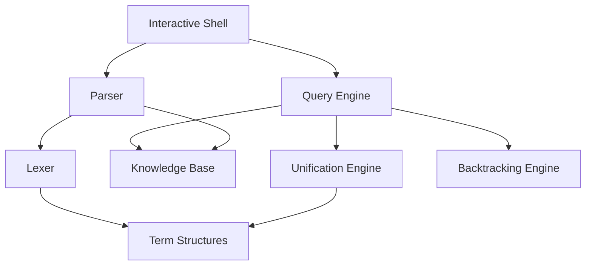

# Design Document: Prolog Interpreter

## Overview

This document describes the design for a minimum Prolog interpreter implemented in C#. The system follows the classic Prolog architecture with three main components: a parser for converting text to internal structures, a knowledge base for storing facts and rules, and a query engine that uses unification and backtracking to find solutions.

The interpreter supports basic Prolog constructs including facts, rules, atoms, variables, and compound terms. It provides an interactive query interface where users can load programs and execute queries against the knowledge base.

## Architecture

The system follows a layered architecture with clear separation of concerns:



**Core Components:**
- **Interactive Shell**: Handles user input/output and program lifecycle
- **Parser/Lexer**: Converts Prolog text into internal term structures
- **Knowledge Base**: Stores and retrieves facts and rules
- **Query Engine**: Orchestrates query resolution using unification and backtracking
- **Unification Engine**: Implements pattern matching and variable binding
- **Term Structures**: Represents Prolog data (atoms, variables, compound terms)

## Components and Interfaces

### Term Representation

All Prolog data is represented using a common `Term` hierarchy:

```csharp
public abstract class Term
{
    public abstract bool IsVariable { get; }
    public abstract Term Substitute(Dictionary<string, Term> bindings);
    public abstract override string ToString();
}

public class Atom : Term
{
    public string Name { get; }
    public override bool IsVariable => false;
}

public class Variable : Term  
{
    public string Name { get; }
    public override bool IsVariable => true;
}

public class Compound : Term
{
    public string Functor { get; }
    public List<Term> Arguments { get; }
    public int Arity => Arguments.Count;
    public override bool IsVariable => false;
}
```

### Parser Interface

The parser converts Prolog source text into internal structures:

```csharp
public interface IParser
{
    ParseResult ParseProgram(string source);
    ParseResult ParseQuery(string source);
}

public class ParseResult
{
    public bool Success { get; }
    public List<Clause> Clauses { get; }
    public Term Query { get; }
    public string ErrorMessage { get; }
}

public class Clause
{
    public Term Head { get; }
    public List<Term> Body { get; } // Empty for facts
    public bool IsFact => Body.Count == 0;
}
```

### Knowledge Base Interface

The knowledge base stores and retrieves program clauses:

```csharp
public interface IKnowledgeBase
{
    void AddClause(Clause clause);
    IEnumerable<Clause> GetMatchingClauses(Term goal);
    void Clear();
    int ClauseCount { get; }
}
```

### Query Engine Interface

The query engine finds solutions through unification and backtracking:

```csharp
public interface IQueryEngine
{
    IEnumerable<Solution> Solve(Term query);
}

public class Solution
{
    public Dictionary<string, Term> Bindings { get; }
    public bool IsSuccess { get; }
    
    public static Solution Success(Dictionary<string, Term> bindings);
    public static Solution Failure();
}
```

### Unification Engine Interface

The unification engine implements pattern matching:

```csharp
public interface IUnificationEngine
{
    UnificationResult Unify(Term term1, Term term2, Dictionary<string, Term> bindings);
}

public class UnificationResult
{
    public bool Success { get; }
    public Dictionary<string, Term> Bindings { get; }
    
    public static UnificationResult Success(Dictionary<string, Term> bindings);
    public static UnificationResult Failure();
}
```

## Data Models

### Term Structure Hierarchy

The system uses a polymorphic term hierarchy to represent all Prolog data:

- **Atom**: Simple constants like `tom`, `parent`, `true`
- **Variable**: Placeholders like `X`, `Person`, `_` (anonymous)
- **Compound**: Structured terms like `parent(tom, bob)`, `likes(X, Y)`

### Clause Representation

Program clauses are represented uniformly:
- **Facts**: `Clause` with non-empty `Head` and empty `Body`
- **Rules**: `Clause` with non-empty `Head` and non-empty `Body`

### Variable Bindings

Variable bindings are maintained using `Dictionary<string, Term>` where:
- Key: Variable name (e.g., "X", "Person")
- Value: Bound term (atom, compound, or another variable)

### Query Solutions

Solutions contain variable bindings that satisfy the query:
- Success solutions include all variable bindings
- Failure solutions indicate no match was found
- Multiple solutions are returned through `IEnumerable<Solution>`

## Correctness Properties

*A property is a characteristic or behavior that should hold true across all valid executions of a system-essentially, a formal statement about what the system should do. Properties serve as the bridge between human-readable specifications and machine-verifiable correctness guarantees.*

Based on the prework analysis, the following properties ensure system correctness:

### Property 1: Parser Round-Trip Consistency
*For any* valid Prolog program, parsing then pretty-printing then parsing again should produce equivalent internal structures.
**Validates: Requirements 1.6**

### Property 2: Syntax Recognition Completeness  
*For any* valid Prolog syntax element (atoms, variables, compounds, facts, rules), the parser should correctly identify and categorize it according to Prolog syntax rules.
**Validates: Requirements 4.1, 4.2, 4.3, 4.4, 4.5**

### Property 3: Knowledge Base Storage Consistency
*For any* fact or rule added to the knowledge base, querying for clauses with matching functors should return the stored clause with preserved structure.
**Validates: Requirements 5.1, 5.2, 5.3**

### Property 4: Unification Correctness
*For any* two terms, unification should follow Prolog unification rules: identical atoms unify with no bindings, variables unify with any term creating bindings, and compound terms unify when all arguments unify recursively.
**Validates: Requirements 3.1, 3.2, 3.3**

### Property 5: Query Solution Completeness
*For any* query against a knowledge base, the query engine should find all valid solutions through backtracking and return appropriate failure when no solutions exist.
**Validates: Requirements 2.1, 2.2, 2.3, 2.4, 2.5**

### Property 6: Variable Binding Consistency
*For any* query resolution process, once a variable is bound to a term, that binding should remain consistent throughout the entire resolution process.
**Validates: Requirements 3.5**

### Property 7: Error Handling Robustness
*For any* invalid Prolog syntax input, the parser should return descriptive error messages rather than crashing or producing incorrect results.
**Validates: Requirements 1.4**

### Property 8: Knowledge Base Ordering Determinism
*For any* sequence of clauses added to the knowledge base, retrieval should maintain insertion order to ensure deterministic behavior.
**Validates: Requirements 5.4, 5.5**

## Error Handling

The system implements comprehensive error handling at multiple levels:

### Parser Error Handling
- **Lexical Errors**: Invalid characters, unterminated strings, malformed numbers
- **Syntax Errors**: Missing operators, unbalanced parentheses, invalid clause structure
- **Semantic Errors**: Invalid functor names, malformed terms

Error messages include:
- Line and column position information
- Description of expected vs. actual tokens
- Suggestions for common syntax mistakes

### Query Engine Error Handling
- **Runtime Errors**: Stack overflow during deep recursion, infinite loops
- **Type Errors**: Invalid operations on terms
- **Resource Errors**: Memory exhaustion, timeout limits

### Unification Error Handling
- **Occurs Check**: Prevent infinite structures (X = f(X))
- **Type Conflicts**: Attempting to unify incompatible terms
- **Binding Conflicts**: Variable already bound to different term

## Testing Strategy

The testing approach combines unit testing for specific examples with property-based testing for comprehensive coverage.

### Unit Testing Approach
Unit tests focus on:
- **Specific Examples**: Known good/bad inputs with expected outputs
- **Edge Cases**: Empty programs, single-character atoms, deeply nested terms
- **Error Conditions**: Malformed syntax, resource exhaustion scenarios
- **Integration Points**: Parser-to-knowledge base, query engine coordination

Example unit tests:
- Parse simple fact: `parent(tom, bob).`
- Parse complex rule: `ancestor(X, Z) :- parent(X, Y), ancestor(Y, Z).`
- Query with no solutions: `?- parent(nonexistent, bob).`
- Unify identical atoms: `tom` with `tom`

### Property-Based Testing Approach
Property tests verify universal correctness across randomized inputs:

**Testing Framework**: Use **FsCheck** for C# property-based testing
**Test Configuration**: Minimum 100 iterations per property test
**Test Tagging**: Each test references its design property with format:
`// Feature: prolog-interpreter, Property N: [property description]`

**Property Test Generators**:
- **Term Generator**: Creates random atoms, variables, and compound terms
- **Program Generator**: Creates valid Prolog programs with facts and rules  
- **Query Generator**: Creates valid queries with various goal structures
- **Syntax Generator**: Creates both valid and invalid syntax for error testing

**Key Property Tests**:
1. **Round-trip parsing** (Property 1): Generate valid programs, parse→print→parse
2. **Syntax recognition** (Property 2): Generate syntax elements, verify correct categorization
3. **Knowledge base consistency** (Property 3): Add clauses, verify retrieval
4. **Unification correctness** (Property 4): Generate term pairs, verify unification rules
5. **Query completeness** (Property 5): Generate queries, verify all solutions found
6. **Binding consistency** (Property 6): Generate complex queries, verify binding coherence
7. **Error robustness** (Property 7): Generate invalid syntax, verify error messages
8. **Ordering determinism** (Property 8): Add clauses in different orders, verify consistency

### Test Data Strategy
- **Minimal Examples**: Simple cases that demonstrate core functionality
- **Realistic Programs**: Family tree, graph traversal, simple logic puzzles
- **Stress Testing**: Large programs, deep recursion, many variables
- **Boundary Cases**: Empty inputs, maximum size limits, special characters

### Integration Testing
- **End-to-End Workflows**: Load program → execute queries → verify results
- **Interactive Session Testing**: Simulate user interactions with the shell
- **Performance Testing**: Measure query response times, memory usage
- **Compatibility Testing**: Verify behavior matches standard Prolog semantics